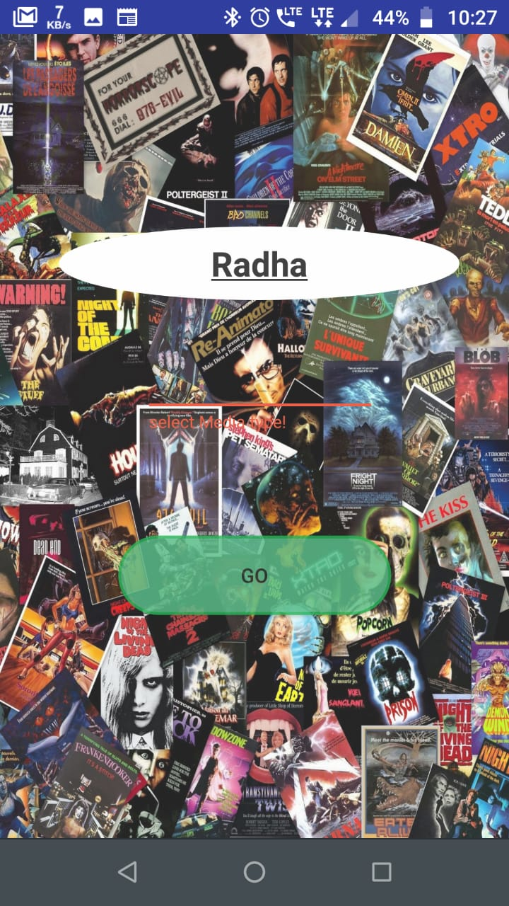
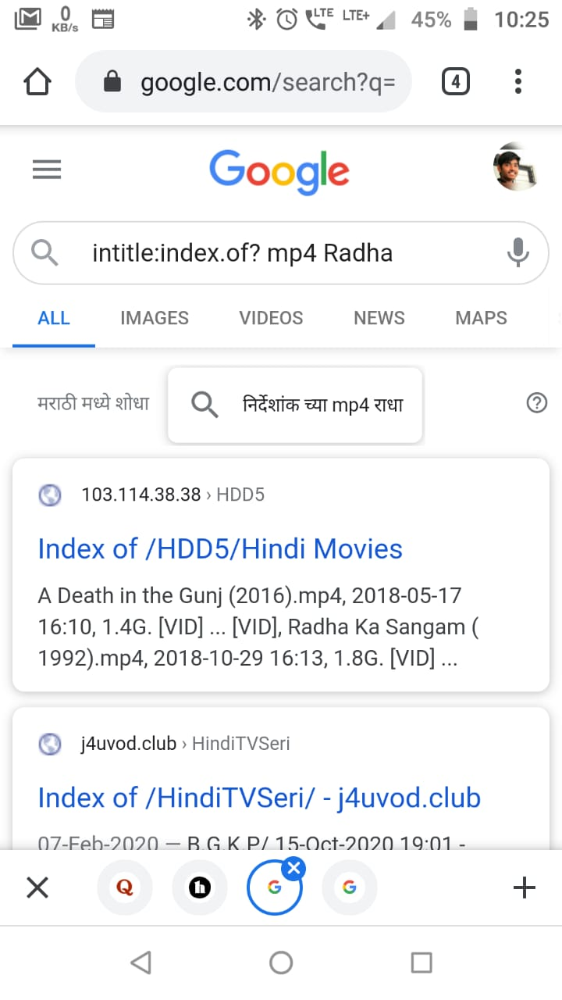
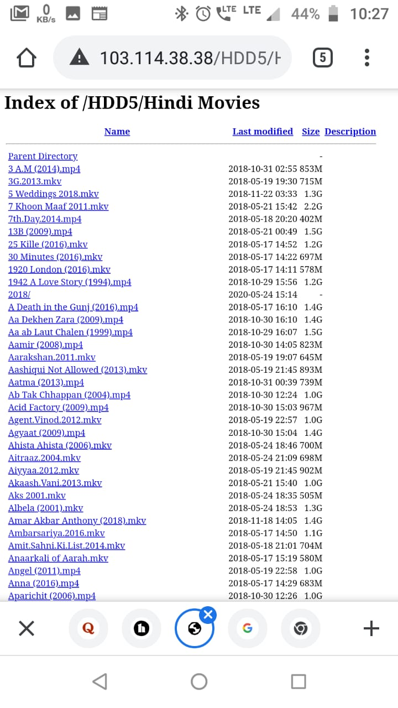

# Direct Media
  Download any media using Android Phone
  Get instant downloadable link of any media
Direct media is an Android app  helps to find direct index of file searched.
### Based on Google search using Operators.

## Installation

Install the APK: Android Application Package on desired android system

Check on Unknown source installation

## Use
Write the name of desired media
Search it!
It will show some tremendous results of index pages in Google search.
Visit as per choice and click on file to download.
there you go!

### Please make sure to allow permissions from the app.

## Refer Snapshots

### Home Screen

### Google Query for unique Result

### All indexed file with Downloadable links on Click.

